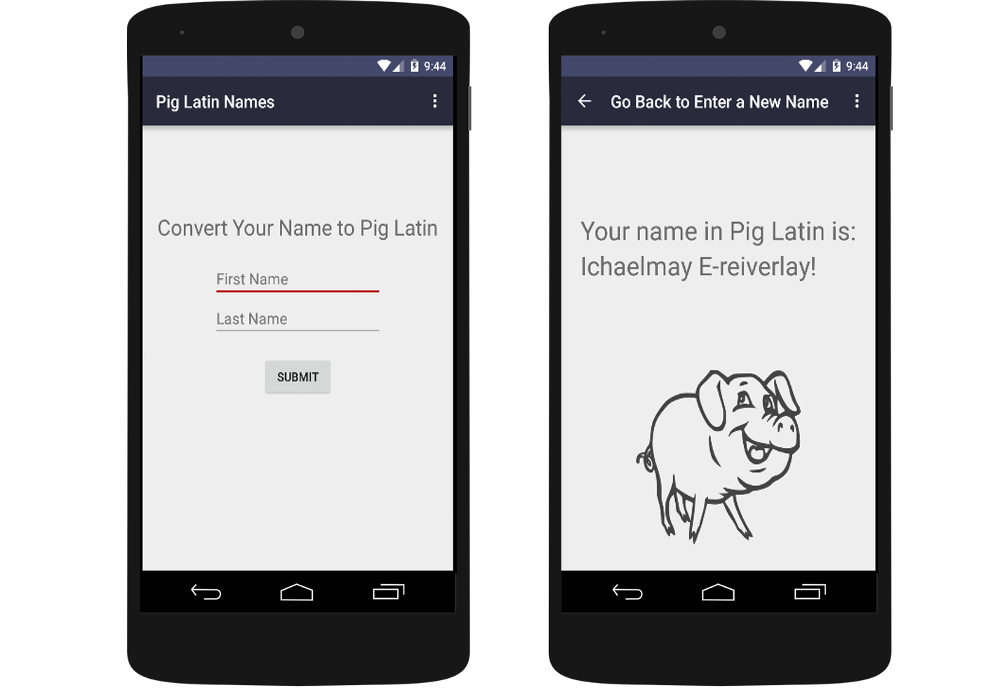

<h1>Pig Latin</h1>
<h2>Android App</h2>

<h4>Objective</h4>

The goal of this was to build a simple Android App to familiarize myself with the Android Studio environment.

<h4>My Solution</h4>

I decided to make a simple application that tranlates a users name into Pig Latin. This application utilizes a simple input form and takes a users first and last name as parameters and tranlates them into Pig Latin using string manipulations.

<h4>The Result</h4>

I was able to make a simple Android App to familiarize myself with the Android Studio environment.

